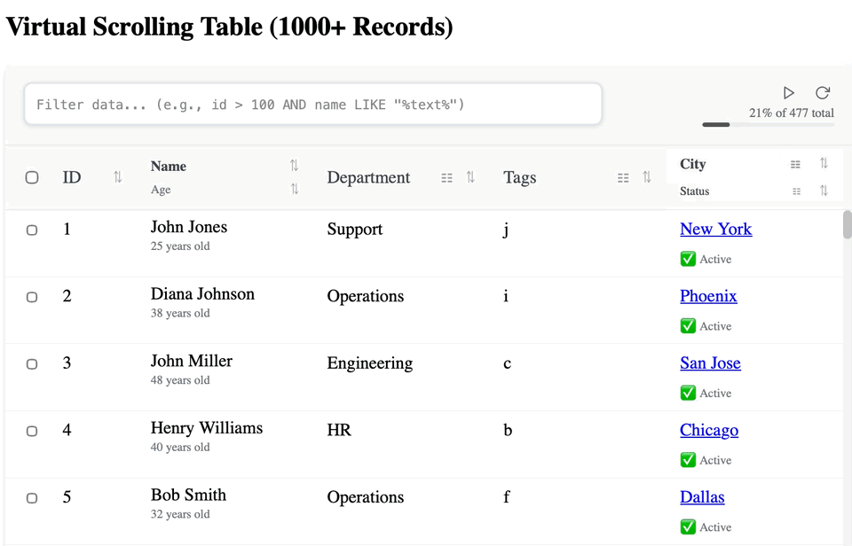

# DivTable Widget

A modern, flexible table widget built with CSS Grid and Flexbox instead of HTML tables, featuring Monaco Editor integration for advanced query capabilities.



## Features

- **Modern CSS-based Layout**: Uses CSS Grid and Flexbox for flexible, responsive design
- **Advanced Query Language**: Monaco Editor integration with intelligent autocomplete and syntax highlighting
- **Virtual Scrolling**: Efficiently handle large datasets with pagination support
- **Auto-Fetch**: Automated pagination with play/pause/resume controls
- **Grouping & Sorting**: Multi-level grouping and sorting capabilities
- **Selection Management**: Single and multi-row selection with checkbox support
- **Loading States**: Configurable loading placeholders and progress indicators
- **Keyboard Navigation**: Full keyboard accessibility with arrow key navigation
- **Responsive Design**: Adaptive column sizing and mobile-friendly layout

## Installation

```bash
npm install divtable-widget monaco-editor
```

## Quick Start

### Basic Usage

```html
<!DOCTYPE html>
<html>
<head>
  <link rel="stylesheet" href="node_modules/divtable-widget/src/div-table.css">
  <script src="https://cdnjs.cloudflare.com/ajax/libs/monaco-editor/0.52.2/min/vs/loader.min.js"></script>
</head>
<body>
  <div id="table-container"></div>
  
  <script src="node_modules/divtable-widget/src/query.js"></script>
  <script src="node_modules/divtable-widget/src/div-table.js"></script>
  <script>
    // Initialize Monaco Editor
    require.config({ paths: { vs: 'https://cdnjs.cloudflare.com/ajax/libs/monaco-editor/0.52.2/min/vs' }});
    require(['vs/editor/editor.main'], function() {
      const divTable = new DivTable(monaco, {
        tableWidgetElement: document.getElementById('table-container'),
        columns: [
          { field: 'id', header: 'ID', primaryKey: true },
          { field: 'name', header: 'Name' },
          { field: 'email', header: 'Email' },
          { field: 'status', header: 'Status' }
        ],
        data: [
          { id: 1, name: 'John Doe', email: 'john@example.com', status: 'active' },
          { id: 2, name: 'Jane Smith', email: 'jane@example.com', status: 'inactive' }
        ],
        showCheckboxes: true,
        multiSelect: true,
        onSelectionChange: (selectedRows) => {
          console.log('Selected:', selectedRows);
        }
      });
    });
  </script>
</body>
</html>
```

### With Virtual Scrolling

```javascript
const divTable = new DivTable(monaco, {
  tableWidgetElement: document.getElementById('table-container'),
  columns: [
    { field: 'id', header: 'ID', primaryKey: true },
    { field: 'name', header: 'Name' },
    { field: 'age', header: 'Age' }
  ],
  virtualScrolling: true,
  pageSize: 100,
  totalRecords: 10000,
  showAutoFetchButton: true,
  autoFetchDelay: 500,
  onNextPage: async () => {
    const nextPage = await fetchDataFromServer(currentPage + 1);
    divTable.appendData(nextPage);
  }
});
```

## Configuration Options

### Core Options

| Option | Type | Default | Description |
|--------|------|---------|-------------|
| `tableWidgetElement` | HTMLElement | **required** | Container element for the table |
| `columns` | Array | **required** | Column definitions |
| `data` | Array | `[]` | Initial data array |
| `showCheckboxes` | Boolean | `true` | Show selection checkboxes |
| `multiSelect` | Boolean | `true` | Allow multiple row selection |

### Virtual Scrolling Options

| Option | Type | Default | Description |
|--------|------|---------|-------------|
| `virtualScrolling` | Boolean | `false` | Enable virtual scrolling mode |
| `pageSize` | Number | `100` | Number of rows per page |
| `totalRecords` | Number | `data.length` | Total number of records |
| `loadingThreshold` | Number | `pageSize * 0.8` | Trigger loading when this many rows from end |
| `showAutoFetchButton` | Boolean | `true` | Show auto-fetch play/pause controls |
| `autoFetchDelay` | Number | `500` | Delay between auto-fetch requests (ms) |

### Callbacks

| Option | Type | Description |
|--------|------|-------------|
| `onSelectionChange` | Function | Called when row selection changes |
| `onRowFocus` | Function | Called when a row receives focus |
| `onNextPage` | Function | Called to load next page of data |
| `onPreviousPage` | Function | Called to load previous page |
| `onRefresh` | Function | Called when refresh button is clicked |

### Loading Options

| Option | Type | Default | Description |
|--------|------|---------|-------------|
| `showLoadingPlaceholder` | Boolean | `true` | Show loading state when no data |
| `showRefreshButton` | Boolean | `false` | Show refresh button in toolbar |

## Query Language

The widget includes a powerful query language with Monaco Editor integration:

### Syntax

```
field operator value [AND/OR field operator value]
```

### Operators

- `=` - Equals
- `!=` - Not equals
- `>` - Greater than
- `<` - Less than
- `>=` - Greater than or equal
- `<=` - Less than or equal
- `CONTAINS` - String contains (case-insensitive)
- `STARTS_WITH` - String starts with
- `ENDS_WITH` - String ends with
- `IN` - Value in list: `status IN (active, pending)`
- `BETWEEN` - Value in range: `age BETWEEN (18, 65)`

### Examples

```
status = "active"
age > 18 AND status = "active"
name CONTAINS "John"
created_at BETWEEN (2024-01-01, 2024-12-31)
status IN (active, pending, review)
```

## API Methods

### Data Management

```javascript
// Update the table with new data
divTable.updateData(newData);

// Append data (for pagination)
divTable.appendData(moreData);

// Set total record count
divTable.setTotalRecords(1000);

// Get current data
const data = divTable.getData();
```

### Selection

```javascript
// Get selected rows
const selected = divTable.getSelectedRows();

// Select row by ID
divTable.selectRow(rowId);

// Clear selection
divTable.clearSelection();
```

### Loading State

```javascript
// Show loading state
divTable.setLoading(true);

// Hide loading state
divTable.setLoading(false);
```

### Auto-Fetch Controls

```javascript
// Start auto-fetching
divTable.startAutoFetch();

// Pause auto-fetching
divTable.pauseAutoFetch();

// Resume auto-fetching
divTable.resumeAutoFetch();

// Stop auto-fetching
divTable.stopAutoFetch();
```

### Grouping and Sorting

```javascript
// Group by field
divTable.groupBy('category');

// Sort by column
divTable.sortBy('name', 'asc'); // or 'desc'
```

## Column Configuration

### Basic Column

```javascript
{
  field: 'name',        // Data field name
  header: 'Full Name',  // Display header
  primaryKey: false     // Is this the primary key?
}
```

### Column Types

The widget automatically handles different data types:

- **Strings**: Text data with CONTAINS, STARTS_WITH, ENDS_WITH operators
- **Numbers**: Numeric data with comparison operators
- **Dates**: Date/time values with BETWEEN operator
- **Booleans**: True/false values with = operator

## Styling

The widget uses CSS variables for easy customization:

```css
.div-table-widget {
  --table-border-color: #e0e0e0;
  --header-bg-color: #f5f5f5;
  --row-hover-color: #f9f9f9;
  --selected-row-color: #e3f2fd;
}
```

## Browser Support

- Chrome/Edge: Latest 2 versions
- Firefox: Latest 2 versions
- Safari: Latest 2 versions

## License

Apache License 2.0

Copyright 2025 DivTable Widget Contributors

Licensed under the Apache License, Version 2.0 (the "License");
you may not use this file except in compliance with the License.
You may obtain a copy of the License at

http://www.apache.org/licenses/LICENSE-2.0

Unless required by applicable law or agreed to in writing, software
distributed under the License is distributed on an "AS IS" BASIS,
WITHOUT WARRANTIES OR CONDITIONS OF ANY KIND, either express or implied.
See the License for the specific language governing permissions and
limitations under the License.

## Contributing

Contributions are welcome! Please feel free to submit a Pull Request.

## Changelog

### Version 1.0.0

- Initial release
- Core table functionality with CSS Grid/Flexbox layout
- Monaco Editor integration for query language
- Virtual scrolling support
- Auto-fetch pagination
- Grouping and sorting
- Selection management
- Keyboard navigation
