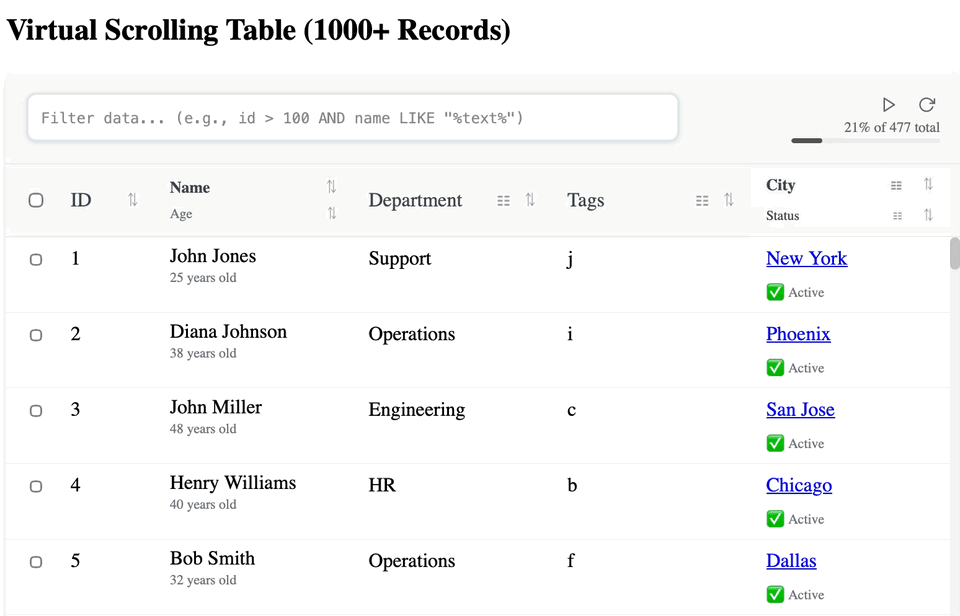

# DivTable Widget

A modern, flexible table widget built with CSS Grid and Flexbox instead of HTML tables, featuring Monaco Editor integration for advanced query capabilities.



## Features

- **Modern CSS-based Layout**: Uses CSS Grid and Flexbox for flexible, responsive design
- **Advanced Query Language**: Monaco Editor integration with intelligent autocomplete and syntax highlighting
- **Virtual Scrolling**: Efficiently handle large datasets with pagination support
- **Fixed (Frozen) Columns**: Keep important columns visible while scrolling horizontally
- **Summary Rows**: Aggregate calculations (sum, avg, count, min, max) with header and group summaries
- **Auto-Fetch**: Automated pagination with play/pause/resume controls
- **Grouping & Sorting**: Multi-level grouping with 4-state sorting (alphabetical asc/desc, count asc/desc)
- **Selection Management**: Single and multi-row selection with checkbox support
- **Filter Selected Rows**: Toggle to show only selected rows
- **Loading States**: Configurable loading placeholders and progress indicators with visual feedback
- **Keyboard Navigation**: Full keyboard accessibility with arrow key navigation
- **Responsive Design**: Adaptive column sizing and mobile-friendly layout
- **Composite Columns**: Stack multiple fields in one column or create two-line headers
- **Dark Mode Support**: Built-in dark mode with a single class toggle

## Installation

```bash
npm install @vii7/div-table-widget monaco-editor
```

## Usage Options

## Dark Mode

DivTable supports a built-in dark mode using CSS variables. To enable dark mode, add the `dark` class to a parent element (such as `<body class="dark">`). All table colors and UI elements will automatically switch to a dark theme.

**Example:**

```html
<body class="dark">
  <div id="table-container"></div>
  <!-- ... -->
</body>
```

You can toggle dark mode dynamically by adding or removing the `dark` class with JavaScript:

```js
document.body.classList.toggle('dark');
```

All color variables are defined for both light and dark modes in the CSS. No extra configuration is needed.

### Option 1: Minified (Production)

```html
<!-- CSS -->
<link rel="stylesheet" href="node_modules/@vii7/div-table-widget/dist/divtable.min.css">

<!-- Monaco Editor (from CDN) -->
<script src="https://cdnjs.cloudflare.com/ajax/libs/monaco-editor/0.52.2/min/vs/loader.min.js"></script>

<!-- DivTable Widget -->
<script src="node_modules/@vii7/div-table-widget/src/query.js"></script>
<script src="node_modules/@vii7/div-table-widget/dist/divtable.min.js"></script>
```

### Option 2: Source (Development/Debugging)

```html
<!-- CSS -->
<link rel="stylesheet" href="node_modules/@vii7/div-table-widget/src/div-table.css">

<!-- Monaco Editor (from CDN) -->
<script src="https://cdnjs.cloudflare.com/ajax/libs/monaco-editor/0.52.2/min/vs/loader.min.js"></script>

<!-- DivTable Widget -->
<script src="node_modules/@vii7/div-table-widget/src/query.js"></script>
<script src="node_modules/@vii7/div-table-widget/src/div-table.js"></script>
```

| File | Size | Description |
|------|------|-------------|
| `dist/divtable.min.js` | ~98KB | Minified JavaScript |
| `dist/divtable.min.css` | ~22KB | Minified CSS |
| `src/div-table.js` | ~220KB | Source JavaScript |
| `src/div-table.css` | ~33KB | Source CSS (with CSS variables) |
| `src/query.js` | ~78KB | Query language engine (required) |

## Quick Start

### Basic Usage

```html
<!DOCTYPE html>
<html>
<head>
  <link rel="stylesheet" href="node_modules/@vii7/div-table-widget/dist/divtable.min.css">
  <script src="https://cdnjs.cloudflare.com/ajax/libs/monaco-editor/0.52.2/min/vs/loader.min.js"></script>
</head>
<body>
  <div id="table-container"></div>
  
  <script src="node_modules/@vii7/div-table-widget/src/query.js"></script>
  <script src="node_modules/@vii7/div-table-widget/dist/divtable.min.js"></script>
  <script>
    // Initialize Monaco Editor
    require.config({ paths: { vs: 'https://cdnjs.cloudflare.com/ajax/libs/monaco-editor/0.52.2/min/vs' }});
    require(['vs/editor/editor.main'], function() {
      const divTable = new DivTable(monaco, {
        tableWidgetElement: document.getElementById('table-container'),
        columns: [
          { field: 'id', header: 'ID', primaryKey: true },
          { field: 'name', header: 'Name' },
          { field: 'email', header: 'Email' },
          { field: 'status', header: 'Status' }
        ],
        data: [
          { id: 1, name: 'John Doe', email: 'john@example.com', status: 'active' },
          { id: 2, name: 'Jane Smith', email: 'jane@example.com', status: 'inactive' }
        ],
        // New: Set initial grouping and sorting
        group: 'status', // Group by 'status' field on load
        sort: { field: 'name', direction: 'asc' }, // Sort by 'name' ascending on load
        showCheckboxes: true,
        multiSelect: true,
        onSelectionChange: (selectedRows) => {
          console.log('Selected:', selectedRows);
        }
      });
    });
  </script>
</body>
</html>
```

### With Virtual Scrolling

```javascript
const divTable = new DivTable(monaco, {
  tableWidgetElement: document.getElementById('table-container'),
  columns: [
    { field: 'id', header: 'ID', primaryKey: true },
    { field: 'name', header: 'Name' },
    { field: 'age', header: 'Age' }
  ],
  virtualScrolling: true,
  pageSize: 100,
  totalRecords: 10000,
  showAutoFetchButton: true,
  autoFetchDelay: 500,
  onNextPage: async () => {
    const nextPage = await fetchDataFromServer(currentPage + 1);
    divTable.appendData(nextPage);
  }
});
```

## Configuration Options

### Core Options

| Option | Type | Default | Description |
|--------|------|---------|-------------|
| `tableWidgetElement` | HTMLElement | **required** | Container element for the table |
| `columns` | Array | **required** | Column definitions (see Column Configuration) |
| `data` | Array | `[]` | Initial data array. If not provided and `onNextPage` is available, first page will be loaded automatically |
| `showCheckboxes` | Boolean | `true` | Show selection checkboxes |
| `multiSelect` | Boolean | `true` | Allow multiple row selection |
| `primaryKeyField` | String | `'id'` | Field to use as primary key (auto-detected from columns if not specified) |
| `group` | String | `null` | Field to group by initially (applies grouping on load) |
| `sort` | Object | `null` | Initial sort: `{ field: string, direction: 'asc'|'desc' }` |
| `fixedColumns` | Number | `0` | Number of columns to freeze on the left side when scrolling horizontally |
| `showHeaderSummary` | Boolean | `false` | Show summary row at top with aggregates for all visible data |
| `showGroupSummary` | Boolean | `false` | Show summary row after each group with group aggregates |

### Virtual Scrolling Options

| Option | Type | Default | Description |
|--------|------|---------|-------------|
| `virtualScrolling` | Boolean | `false` | Enable virtual scrolling mode for large datasets |
| `pageSize` | Number | `100` | Number of rows per page |
| `totalRecords` | Number | `pageSize * 10` | Total number of records available (for progress calculation) |
| `loadingThreshold` | Number | `pageSize * 0.8` | Trigger loading when this many rows from end |
| `scrollThreshold` | Number | `0.95` | Fallback percentage-based scroll threshold |
| `showAutoFetchButton` | Boolean | `true` | Show auto-fetch play/pause/resume button |
| `autoFetchDelay` | Number | `500` | Delay between auto-fetch requests (milliseconds) |

### UI Options

| Option | Type | Default | Description |
|--------|------|---------|-------------|
| `showLoadingPlaceholder` | Boolean | `true` | Show loading skeleton when no data is present |
| `showRefreshButton` | Boolean | `false` | Show refresh button in info section |

### Callbacks

| Option | Type | Parameters | Description |
|--------|------|------------|-------------|
| `onSelectionChange` | Function | `(selectedRows)` | Called when row selection changes. Receives array of selected data objects |
| `onRowFocus` | Function | `(rowData, groupInfo)` | Called when a row or group header receives focus |
| `onNextPage` | Function | `(page, pageSize)` | Called to load next page of data. Should return array of records or Promise |
| `onPreviousPage` | Function | `(page, pageSize)` | Called to load previous page (optional) |
| `onRefresh` | Function | `()` | Called when refresh button is clicked. Should reload data |

## Query Language

The widget includes a powerful query language with Monaco Editor integration:

### Syntax

```
field operator value [AND/OR field operator value]
```

### Operators

- `=` - Equals
- `!=` - Not equals
- `>` - Greater than
- `<` - Less than
- `>=` - Greater than or equal
- `<=` - Less than or equal
- `CONTAINS` - String contains (case-insensitive)
- `STARTS_WITH` - String starts with
- `ENDS_WITH` - String ends with
- `IN` - Value in list: `status IN (active, pending)`
- `BETWEEN` - Value in range: `age BETWEEN (18, 65)`

### Examples

```
status = "active"
age > 18 AND status = "active"
name CONTAINS "John"
created_at BETWEEN (2024-01-01, 2024-12-31)
status IN (active, pending, review)
```

## Keyboard Navigation

The widget provides full keyboard accessibility:

### Navigation Keys

| Key | Action |
|-----|--------|
| `↑` / `↓` | Navigate between rows and group headers |
| `→` | Expand collapsed group (when focused on group header) |
| `←` | Collapse expanded group (when focused on group header) |
| `Space` / `Enter` | Toggle selection of focused row or group |
| `Tab` | Navigate between checkboxes (if enabled) |

### Focus Behavior

- When checkboxes are enabled, focus moves to the checkbox element
- When checkboxes are disabled, focus moves to the row element
- Group headers are always focusable and can be expanded/collapsed with arrow keys
- Selection changes trigger the `onSelectionChange` callback
- Focus changes trigger the `onRowFocus` callback

## API Methods

### Data Management

```javascript
// Apply a query filter to the data
divTable.applyQuery('status = "active" AND age > 18');

// Add a single record (upsert - updates if exists, adds if new)
divTable.addRecord({ id: 1, name: 'John Doe', email: 'john@example.com' });

// Remove a record by ID
const removedRecord = divTable.removeRecord(1);

// Refresh the table data (reloads from onNextPage if virtual scrolling)
await divTable.refresh();
```

### Selection

```javascript
// Get selected rows (returns array of data objects)
const selected = divTable.getSelectedRows();

// Toggle filter to show only selected rows
divTable.toggleSelectedRowsFilter(true);  // Show only selected
divTable.toggleSelectedRowsFilter(false); // Show all rows
divTable.toggleSelectedRowsFilter();      // Toggle current state

// Clear all selections
divTable.clearSelection();
```

### Grouping and Sorting

```javascript
// Group by a field
divTable.group('category');

// Clear grouping
divTable.clearGrouping();

// Sort by a field
divTable.sort('name', 'asc'); // 'asc' or 'desc'
divTable.sort('age');         // Toggles between asc/desc

// For grouped fields, sorting cycles through 4 states:
// 1. Sort groups alphabetically ascending (↑ₐ)
// 2. Sort groups alphabetically descending (↓z)
// 3. Sort groups by count ascending (↑₁)
// 4. Sort groups by count descending (↓₉)
// 5. Back to no sort
```

### Auto-Fetch Controls

```javascript
// The auto-fetch feature automatically loads pages with play/pause/resume controls
// These methods are called internally by the UI buttons, but can also be called programmatically:

// Start auto-fetching all pages
divTable.startAutoFetch();

// Stop auto-fetching
divTable.stopAutoFetch();

// Note: Pause/resume is handled automatically by the UI button
// The isAutoFetching and autoFetchPaused properties track the state
```

### Fixed (Frozen) Columns

Keep the first N columns fixed (frozen) on the left side while scrolling horizontally:

**Visual Layout:**

```
┌──────────────────────────┬─────────────────────────────────────────────────┐
│    FIXED SECTION         │              SCROLLABLE SECTION  ──────────►   │
│  (stays in place)        │           (scrolls horizontally)               │
├──────────────────────────┼─────────────────────────────────────────────────┤
│  ☐  │  ID  │  Name       │  Email          │  Department  │  Status  │ ...│
├──────────────────────────┼─────────────────────────────────────────────────┤
│  ☐  │  1   │  John Doe   │  john@mail.com  │  Engineering │  Active  │    │
│  ☐  │  2   │  Jane Smith │  jane@mail.com  │  Marketing   │  Active  │    │
│  ☐  │  3   │  Bob Wilson │  bob@mail.com   │  Sales       │  Inactive│    │
└──────────────────────────┴─────────────────────────────────────────────────┘
        ▲                                    ▲
        │                                    │
   Columns 1-2                         Columns 3+ scroll
   stay fixed                          left/right
```

```javascript
const divTable = new DivTable(monaco, {
  tableWidgetElement: document.getElementById('table-container'),
  columns: [
    { field: 'id', header: 'ID', primaryKey: true },
    { field: 'name', header: 'Name' },
    { field: 'email', header: 'Email' },
    { field: 'department', header: 'Department' },
    { field: 'status', header: 'Status' }
  ],
  data: myData,
  fixedColumns: 2  // Freeze first 2 columns (ID and Name)
});
```

**How it works:**

- The first N data columns stay fixed on the left side
- Remaining columns scroll horizontally
- Vertical scrolling is synchronized between fixed and scrollable sections
- Checkbox column (if enabled) is always part of the fixed section
- Works with composite columns - each composite group counts as one column

### Summary Rows (Aggregates)

Display aggregate calculations in summary rows at the header level (grand totals) or after each group (subtotals):

**Visual Layout:**

```
┌─────────────────────────────────────────────────────────────────────────┐
│  ☐  │  Name          │  Department  │  Age   │      Salary             │
├─────────────────────────────────────────────────────────────────────────┤
│     │                │              │ 32 avg │    $385,000  ◄── Header Summary (Grand Total)
├═════════════════════════════════════════════════════════════════════════┤
│  ▼  │ Engineering (3)                                                   │  ◄── Group Header
├─────────────────────────────────────────────────────────────────────────┤
│  ☐  │ Alice Chen     │ Engineering  │   28   │     $95,000             │
│  ☐  │ Bob Smith      │ Engineering  │   35   │    $120,000             │
│  ☐  │ Carol Davis    │ Engineering  │   42   │    $110,000             │
├─────────────────────────────────────────────────────────────────────────┤
│     │                │              │ 35 avg │    $325,000  ◄── Group Summary (Subtotal)
├═════════════════════════════════════════════════════════════════════════┤
│  ▶  │ Marketing (2)                                       (collapsed)   │  ◄── Collapsed Group
├─────────────────────────────────────────────────────────────────────────┤
│     │                │              │ 27 avg │     $60,000  ◄── Summary visible even when collapsed
└─────────────────────────────────────────────────────────────────────────┘
```

```javascript
const divTable = new DivTable(monaco, {
  tableWidgetElement: document.getElementById('table-container'),
  columns: [
    { field: 'id', label: 'ID', primaryKey: true },
    { field: 'name', label: 'Name' },
    { field: 'department', label: 'Department', groupable: true },
    { 
      field: 'salary', 
      label: 'Salary',
      align: 'right',  // Right-align numeric values
      aggregate: 'sum',  // Calculate sum for this column
      aggregateRender: (value) => `$${value.toLocaleString()}`  // Format aggregate value
    },
    {
      field: 'age',
      label: 'Age',
      aggregate: 'avg',  // Calculate average
      aggregateRender: (value) => `${value.toFixed(1)} avg`
    }
  ],
  data: myData,
  group: 'department',
  showHeaderSummary: true,   // Show grand total row at top
  showGroupSummary: true     // Show subtotal after each group
});
```

**Aggregate Types:**

| Type | Description |
|------|-------------|
| `sum` | Sum of all numeric values |
| `avg` | Average of all numeric values |
| `count` | Count of non-null values |
| `min` | Minimum value |
| `max` | Maximum value |

**Column Configuration for Aggregates:**

```javascript
{
  field: 'amount',
  label: 'Amount',
  align: 'right',           // Align cell content (applies to both data and summary cells)
  aggregate: 'sum',          // Aggregate type: 'sum', 'avg', 'count', 'min', 'max'
  aggregateRender: (value) => `$${value.toFixed(2)}`  // Custom formatting for aggregate value
}
```

**Features:**

- Summary rows remain visible even when groups are collapsed
- Aggregates automatically update when data changes or filters are applied
- Selection-aware: When rows are selected, aggregates reflect only selected data
- Works with fixed columns layout
- Supports custom formatting via `aggregateRender` function

## Column Configuration

### Basic Column

```javascript
{
  field: 'name',           // Data field name (required)
  label: 'Full Name',      // Display header (optional, defaults to field)
  primaryKey: false,       // Is this the primary key? (required for one column)
  hidden: false,           // Hide column (default: false)
  groupable: true,         // Allow grouping by this column (default: true)
  align: 'left',           // Text alignment: 'left', 'center', 'right' (default: 'left')
  render: (value, item) => `<strong>${value}</strong>` // Custom render function
}
```

### Advanced Column Features

#### Responsive Sizing

```javascript
{
  field: 'description',
  label: 'Description',
  responsive: {
    size: 'flexible-large' // 'fixed-narrow' (80px), 'fixed-medium' (120px),
                          // 'flexible-small' (1fr), 'flexible-medium' (2fr),
                          // 'flexible-large' (3fr)
  }
}
```

#### Composite Cells (Multiple Fields in One Column)

Use `fieldCompositeName` to stack multiple columns into a single visual cell:

```javascript
// Stack name and age fields vertically in one column
{
  field: 'name',
  label: 'Name',
  fieldCompositeName: 'person'
},
{
  field: 'age',
  label: 'Age',
  render: (value) => value ? `${value} years old` : 'Age not specified',
  fieldCompositeName: 'person'
}
```

Each field in a composite cell:

- Has its own label in the header (stacked vertically)
- Can have its own render function
- Can be sorted independently by clicking on its label
- Can be grouped if `groupable: true`


### Column Render Function

Custom rendering for cell values:

```javascript
{
  field: 'status',
  label: 'Status',
  render: (value, item) => {
    const colors = { active: 'green', inactive: 'red', pending: 'orange' };
    return `<span style="color: ${colors[value]}">${value}</span>`;
  }
}
```

### Column Types

The widget automatically detects and handles different data types based on the data:

- **Strings**: Text data with CONTAINS, STARTS_WITH, ENDS_WITH operators
- **Numbers**: Numeric data with comparison operators (>, <, >=, <=)
- **Dates**: Date/time values with BETWEEN operator
- **Booleans**: True/false values with = operator
- **Arrays**: Array values are joined with commas for display

## Styling & Customization

The widget uses CSS custom properties (variables) for easy theming. Override these variables in your stylesheet to customize colors:

### CSS Variables Reference

```css
:root {
  /* Primary/Accent Colors */
  --dt-primary: #007bff;              /* Main accent color */
  --dt-primary-hover: #0056b3;        /* Accent hover state */
  
  /* Background Colors */
  --dt-bg-base: #ffffff;              /* Base background */
  --dt-bg-light: #f9f9f7;             /* Light background */
  --dt-bg-hover: rgb(240, 247, 255);  /* Row hover background */
  --dt-bg-selected: rgba(0, 123, 255, 0.1); /* Selected row background */
  --dt-bg-header: #f9f9f7;            /* Header background */
  --dt-bg-summary: #f8f9fa;           /* Summary row background */
  
  /* Border Colors */
  --dt-border-light: #e9ecef;         /* Light borders */
  --dt-border-medium: #e1e5e9;        /* Medium borders */
  --dt-border-dark: #ced4da;          /* Dark borders */
  --dt-border-row: #f1f3f4;           /* Row separator */
  
  /* Text Colors */
  --dt-text-primary: #374151;         /* Primary text */
  --dt-text-secondary: #495057;       /* Secondary text */
  --dt-text-muted: #6b7280;           /* Muted/subtle text */
  --dt-text-light: #666666;           /* Light text */
  --dt-text-disabled: #999999;        /* Disabled text */
  
  /* Shadow */
  --dt-shadow: rgba(0, 0, 0, 0.1);    /* Standard shadow */
  
  /* State Colors */
  --dt-error: #dc3545;                /* Error color */
  --dt-success: #28a745;              /* Success color */
  --dt-warning: #ffc107;              /* Warning color */
  --dt-info: #0ea5e9;                 /* Info color */
}
```

### Example: Dark Theme

```css
/* custom-theme.css */
:root {
  --dt-primary: #60a5fa;
  --dt-primary-hover: #3b82f6;
  
  --dt-bg-base: #1f2937;
  --dt-bg-light: #374151;
  --dt-bg-hover: #4b5563;
  --dt-bg-selected: rgba(96, 165, 250, 0.2);
  --dt-bg-header: #374151;
  --dt-bg-summary: #374151;
  
  --dt-border-light: #4b5563;
  --dt-border-medium: #6b7280;
  --dt-border-dark: #9ca3af;
  --dt-border-row: #374151;
  
  --dt-text-primary: #f9fafb;
  --dt-text-secondary: #e5e7eb;
  --dt-text-muted: #9ca3af;
  --dt-text-light: #d1d5db;
  --dt-text-disabled: #6b7280;
  --dt-text-inverse: #1f2937;
  
  --dt-shadow: rgba(0, 0, 0, 0.3);
  
  --dt-button-bg: #4b5563;
  --dt-button-bg-hover: #6b7280;
  --dt-button-text: #f9fafb;
  
  --dt-scrollbar-track: #374151;
  --dt-scrollbar-thumb: #6b7280;
  --dt-scrollbar-thumb-hover: #9ca3af;
}
```

### Variable Categories

| Category | Variables | Description |
|----------|-----------|-------------|
| Primary | `--dt-primary`, `--dt-primary-hover` | Brand/accent colors |
| Background | `--dt-bg-*` | Surface and container backgrounds |
| Border | `--dt-border-*` | Border and separator colors |
| Text | `--dt-text-*` | Typography colors |
| State | `--dt-error`, `--dt-success`, `--dt-warning`, `--dt-info` | Status indicator colors |
| UI | `--dt-button-*`, `--dt-scrollbar-*` | Button and scrollbar styling |

## Browser Support

- Chrome/Edge: Latest 2 versions
- Firefox: Latest 2 versions
- Safari: Latest 2 versions

## License

Apache License 2.0

Copyright 2025 DivTable Widget Contributors

Licensed under the Apache License, Version 2.0 (the "License");
you may not use this file except in compliance with the License.
You may obtain a copy of the License at

http://www.apache.org/licenses/LICENSE-2.0

Unless required by applicable law or agreed to in writing, software
distributed under the License is distributed on an "AS IS" BASIS,
WITHOUT WARRANTIES OR CONDITIONS OF ANY KIND, either express or implied.
See the License for the specific language governing permissions and
limitations under the License.

## Contributing

Contributions are welcome! Please feel free to submit a Pull Request.

## Changelog

### Version 1.0.0

- Initial release
- Core table functionality with CSS Grid/Flexbox layout
- Monaco Editor integration for query language
- Virtual scrolling support
- Auto-fetch pagination
- Grouping and sorting
- Selection management
- Keyboard navigation
